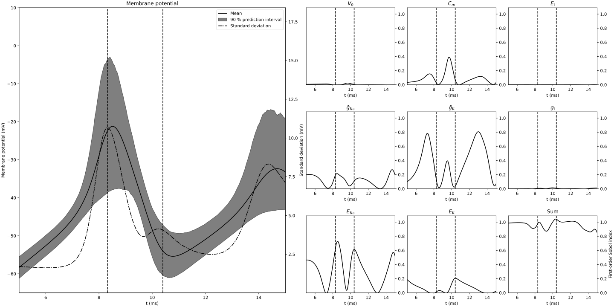

# Hodgkin-Huxley Sensitivity Analysis

Reproduces:

"Uncertainty Propagation in Nerve Impulses Through the Action Potential Mechanism", Valderrama et al.
https://doi.org/10.1186/2190-8567-5-3

with details from:

"Uncertainpy: A Python Toolbox for Uncertainty Quantification and Sensitivity Analysis in Computational Neuroscience",
Simen Tennøe et al.
https://doi.org/10.3389/fninf.2018.00049

# Howto

```shell
virtualenv venv
source venv/bin/activate
pip install -r requirements.txt
make
```

